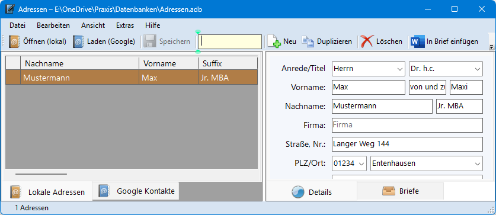

# Adressen

Das Programm zeigt in einer Oberfläche sowohl lokal gespeicherte Adressen wie auch die Google-Kontakte des Benutzers.

Die Adressen lassen sich in Word-Dokumente übertragen. Dazu werden in der Dokumentvorlage Textmarken erstellt, die dann im Briefdokument mit einzelnen Adressdaten gefüllt werden.
Das funktioniert in gleicher Weise auch mit LibreOffice-Dokumenten.

Darüberhinaus beinhaltet das Programm eine komplexe Funktion zum Bedrucken von Briefumschlägen.

Auf Wunsch wird beim Programmstart an anstehende Geburtstage erinnert.

Further information and release downloads at [oss.schielen.de/adressen](https://oss.schielen.de/adressen)
